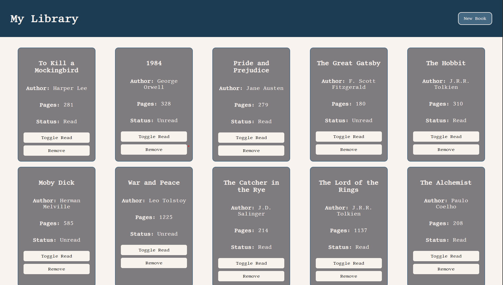

# 📚 Library

A minimal, interactive book management web app built with HTML, CSS, and JavaScript. Users can add books, display them as cards, toggle their read status, and remove them — all within a clean UI powered by a modal form.



---

## 🚀 Live Demo

🔗 [Visit the Live Site](https://library-aryan.netlify.app/)

---

## 🛠 Tech Stack

- **HTML5** – Semantic structure
- **CSS3** – Custom styling and layout
- **JavaScript (Vanilla)** – Core logic and interactivity

---

## ✨ Features

- 📖 Add books using a modal form
- 🗂 Dynamically render book cards
- ✅ Toggle read/unread status
- ❌ Remove books from the library
- 🆔 Unique book identification using `crypto.randomUUID()`
- 🧪 Preloaded with dummy book data for demonstration
- 🎨 Custom font integration (`Libertinus Mono`)
- 🔧 Clean and modular codebase for easy extension

---

## 📂 Project Structure

```
├── index.html
├── style.css
├── script.js
├── assets/
   └── preview.png
```
---

## 📌 Future Enhancements

- 💾 Persistent book storage using `localStorage`
- 🔍 Search and filter functionality
- 📱 Responsive layout for mobile and tablet screens
- 🧹 Input validation and duplicate book prevention
- 🧠 Sorting books by title, author, or read status

---

## 📝 License

This project is licensed under the [MIT License](LICENSE).

---

## 🙌 Acknowledgments

- Fonts provided by [Google Fonts](https://fonts.google.com/)
- Deployed on [Netlify](https://www.netlify.com/)
